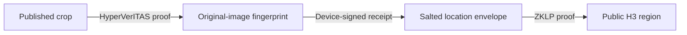

# C2PA private location attestation

The thesis aims to let a reader verify that an edited photograph derives from
a trusted capture inside a stated region, while keeping the original image
and exact coordinates private. This repository contains the first command
line integration of that design.

The current PoC connects HyperVerITAS image-edit proofs, ZKLP location proofs,
and a C2PA manifest. Its location circuit has a known soundness gap, and the
integration tests do not establish end-to-end zero knowledge. Treat this as
an executable research prototype.

## What the demo does

1. **Simulate capture.** Resize a supplied photograph to 1024 by 512 pixels,
   compute its HyperVerITAS fingerprint, and commit to demo coordinates using
   MiMC with a fresh salt. A local P-256 device key signs both public values,
   the image dimensions, the capture time, and the device key ID.
2. **Edit and generate proofs.** Keep the left half of the image as a 512 by
   512 PNG. The Rust CLI generates the HyperVerITAS PST crop proof. The Go
   CLI generates the ZKLP Groth16 proof for the declared H3 cell.
3. **Package.** Put both proofs and the signed receipt inside the custom
   `edu.utdt.td8.zkloc` assertion. A separate C2PA sample editor key signs the
   published PNG.
4. **Verify.** Validate the C2PA asset, check the receipt against an explicitly
   trusted device public key, verify the actual published pixels against the
   receipt fingerprint, and verify the location proof against the receipt
   envelope and the requested region.
5. **Exercise failures.** Run six real negative cases covering signature and
   fingerprint changes, a wrong region, a swapped receipt, and changed pixels.



The device signature connects two independent proof statements. Neither proof
verifies the other, and they do not share a field commitment. The current run
script executes the two provers sequentially.

## Run it

Requirements: Git, Go, a C compiler for the H3 dependency, Rust nightly,
Python 3, and an authenticated GitHub CLI. Run commands from this repository's
root on the branch containing `pipeline/`:

```bash
./pipeline/run.sh
```

Setup initializes the pinned submodules, installs Python dependencies, builds
both proof CLIs, and creates demo keys and proof parameters. Subsequent runs
can reuse that setup without network access:

```bash
PIPELINE_SKIP_SETUP=1 ./pipeline/run.sh
```

Each run replaces `pipeline/out/`. The demo always uses the public UTDT test
coordinates in Buenos Aires and resolution-7 H3 cell `87c2e3020ffffff`.
`DEMO_PHOTO=/absolute/path/photo.jpg ./pipeline/run.sh` changes the input photo;
it does not read that photo's GPS metadata or attest its real capture location.

A successful run exits zero, prints `check 1`, `check 2`, `check 3`, reports
the expected negative-case failures, and prints timings and artifact sizes.

| Output | What to inspect |
| --- | --- |
| `pipeline/out/signed.png` | Published image with the receipt and both proofs embedded |
| `pipeline/out/manifest.json` | Human-readable assertion before C2PA signing |
| `pipeline/out/negative/results.json` | Expected and observed failure for each negative case |
| `pipeline/out/timings.tsv` | Command wall times, including the complete reader verifier |
| `pipeline/generated/tool-versions.json` | Tool versions recorded during setup |

The original image, coordinates, and salt remain in the local ignored output
directories. Share the signed PNG for the demo, rather than the whole output
directory, which also contains private prover inputs.

## Components and review order

| Folder | Responsibility |
| --- | --- |
| [pipeline](pipeline/README.md) | Capture, signed receipt, proof orchestration, packaging, verification, schemas, and tests |
| [editproof](editproof/README.md) | Pinned HyperVerITAS fork with persistent PST parameters and file-based proof commands |
| [locproof](locproof/README.md) | Pinned ZKLP fork with a salted envelope, global H3 region identity, and file-based Groth16 commands |
| [c2pa](c2pa/README.md) | c2patool setup and the original custom-assertion round trip |
| [fixtures](fixtures/README.md) | Public demo-region configuration and generated device identity |

For review, start with the [composition decision](pipeline/COMPOSITION-COMPARISON.md),
then read [the runner](pipeline/run.sh), [the receipt](pipeline/lib/receipt.py),
and [the verifier](pipeline/verify.py). The component submodules pin the
implementations reviewed in [HyperVerITAS PR #1](https://github.com/C2PA-Thesis/HyperVerITAS/pull/1)
and [zk-Location PR #1](https://github.com/C2PA-Thesis/zk-Location/pull/1).

## Research boundaries

- The inherited ZKLP FP32 circuit does not constrain trigonometric hint outputs
  back to the secret coordinates. Native prover preflight rejects the wrong
  demo region, but that is not a security boundary against a modified prover.
- The fingerprint, H3 region, dimensions, device key ID, and asserted time are
  public. Omitting raw coordinates and original pixels from the PNG does not
  establish that the complete protocol leaks no additional information. The
  pinned PST implementation also publishes unmasked polynomial evaluations of
  the original pixels; complete image privacy remains to be established.
- Device capture, GPS, and time are simulated and trusted. Both proof setups
  and the C2PA signing identity are for local testing.
- Only the fixed left-half crop is implemented. Blur, other edits, arbitrary
  image sizes, hardware attestation, and a reader-facing app remain future work.

The [pipeline guide](pipeline/README.md) provides individual commands, fast
tests, historical measurements, and the detailed limitations.
