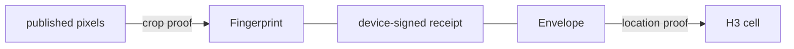

# C2PA private location attestation

Research prototype for thesis P27. A reader checks that a published photo is
the left half of an original captured by a trusted device inside a stated H3
cell. The original pixels and the exact coordinate are not published.

## How the proofs are bound

At capture the device computes two public values and signs them together in a
receipt:

- the **fingerprint**, an Ajtai hash of the original pixels over the
  BLS12-381 scalar field;
- the **envelope**, a MiMC commitment to the coordinate and a fresh salt over
  BN254.

The published PNG carries the receipt, a HyperVerITAS PST proof that its
pixels are the left half of the fingerprinted original, and a ZKLP Groth16
proof that the committed coordinate lies in the claimed cell. The proofs run
on different fields and never reference each other. The device signature over
both values is what binds them to one capture.



## Layout

| Path | Contents |
| --- | --- |
| `crates/crop-proof` | The PST crop proof, extracted from [HyperVerITAS](https://github.com/C2PA-Thesis/HyperVerITAS) at `798554f` (MIT) |
| `location-proof` | Go CLI for the location proof. It builds against the [zk-Location fork](https://github.com/C2PA-Thesis/zk-Location) at `cc8f1c7` as a pinned module: that repository has no license, so its code is not copied here |
| `crates/provenance` | Capture, receipt, C2PA packaging, reader checks, attacks, and the `provenance` CLI |
| `c2pa` | The C2P-19 custom assertion round trip with `c2patool` |

## Run

Requires Rust (the toolchain pinned in `rust-toolchain.toml` installs itself),
Go 1.23 or later, and curl. From the repository root:

```bash
cargo install --path crates/provenance

provenance setup                   # build location-proof, create parameters and keys, fetch samples
provenance demo                    # capture, prove, publish out/signed.png, verify it
provenance verify out/signed.png   # run the reader checks on any file
provenance attack                  # forge tampered copies; each must be rejected
provenance inspect out/signed.png  # print the assertion
```

`provenance demo --photo PATH --at LAT,LON --cell CELL` uses another photo and
simulated coordinate; nothing reads GPS from the photo. `--json` prints one
JSON object per line. Setup writes about 220 MB to `.provenance`, or to
`PROVENANCE_HOME`.

`out/original.png` and `out/secrets.json` are the private witness. Share only
`out/signed.png`.

## Reader checks

They run in order and stop at the first rejection.

| Check | Rejects the file when | Exit status |
| --- | --- | --- |
| C2PA manifest | c2pa-rs reports it neither Valid nor Trusted, or it lacks exactly one `edu.utdt.td8.zkloc` assertion | 10 |
| Device receipt | the receipt is not signed by the trusted device key | 11 |
| Crop proof | the file's pixels are not the left half of the image the receipt fingerprints | 12 |
| Location proof | the proof does not verify for the receipt's envelope and the claimed cell | 13 |

## Attacks

`provenance attack` writes each forgery as a freshly C2PA-signed PNG, so the
rejection has to come from the checks above. The attacker holds the device key
and a second genuine capture: the same photo mirrored, taken at Tokyo Station.

| Attack | Tampering | Rejected by |
| --- | --- | --- |
| `signature` | flip one bit of the device signature | device receipt |
| `fingerprint` | swap two fingerprint values | device receipt |
| `resigned-fingerprint` | swap two fingerprint values and re-sign with the device key | crop proof |
| `pixel` | change one published pixel | crop proof |
| `region` | claim the other capture's cell for this location proof | location proof |
| `cross-photo-location` | attach the other capture's location proof and cell | location proof |
| `cross-photo-receipt` | attach the other capture's receipt, location proof and cell | crop proof |

The wrong-cell case on the prover side is covered in `location-proof/main_test.go`:
the honest prover refuses a cell that does not contain the coordinate.

## Assertion

`edu.utdt.td8.zkloc`, version 2.

| Field | Contents |
| --- | --- |
| `receipt.fingerprint` | 128 BLS12-381 scalars per RGB channel, and the original's size |
| `receipt.envelope` | BN254 scalar |
| `receipt.captured_at` | RFC 3339 time asserted by the device |
| `receipt.device` | SHA-256 of the device public key in SubjectPublicKeyInfo DER |
| `receipt.signature` | Base64 DER ECDSA P-256 over the compact JSON of the four fields above |
| `cell` | H3 cell the location proof claims |
| `location_proof` | Base64 Groth16 proof |
| `image_proof` | Base64 PST proof |

## Known limits

- **The location proof holds for an honest prover only.** The fork's circuit
  says: "The trigonometric hint outputs are not constrained back to Lat/Lng;
  callers must not treat this PoC circuit as malicious-prover sound until that
  upstream limitation is fixed" (`loc2index32/circuit.go` at `cc8f1c7`). A
  modified prover can claim any cell for a genuine envelope.
- **The original image is not hidden.** The fingerprint is deterministic, so
  anyone holding a candidate original can test it, and the PST proof carries
  unmasked evaluations of the original's channel polynomials (see
  `image_openings` in `crates/crop-proof/src/crop.rs`).
- **Both setups are single-party.** Whoever runs `provenance setup` could keep
  the trapdoors and forge either proof.
- **Capture is simulated.** The device key, coordinate and time are demo
  inputs. The C2PA editor signs with the SDK sample certificate, which no trust
  list includes.
- **One edit.** Only a 1024x512 original cropped to its 512x512 left half.

## Measurements

One run on 2026-09-14, macOS 26.5.2 on Apple arm64, release build.

| Step | Time | Output |
| --- | --- | --- |
| Capture: fingerprint, envelope, receipt | 1.8 s | |
| Location proof | 0.7 s | 196 bytes |
| Crop proof | 18.2 s | 36,692 bytes |
| Publish | under 0.1 s | 200,709-byte PNG |
| Verify, all four checks | 1.1 s | |
| All seven attacks | 6.3 s | |
