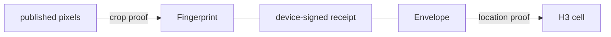

# C2PA private location attestation

Research prototype for thesis P27. A reader checks that a published photo is
the left half of an original captured by a trusted device inside a stated H3
cell. The original pixels and the exact coordinate are not published.

## Background

**C2PA** attaches signed provenance to a media file: "Assertions are wrapped up
with additional information into a digitally signed entity called a claim"
([8], §1.3). Anyone can define assertions under their own namespace:
"Entity-specific namespaces shall begin with the Internet domain name for the
entity similar to how Java packages are defined" ([8], §6.2.1). This project
defines `edu.utdt.td8.zkloc`.

**VerITAS** lets an editor change a signed photo without breaking its
provenance. It "uses succinct zero-knowledge arguments to enable the editor to
make modifications to a captured C2PA image, and replace the signature with a
zk-SNARK that the edited image was derived from a properly signed C2PA image
via an authorized transformation" ([2], §1). The camera signs a lattice hash of
the image, because "the benefit of the lattice hash is that it uses only linear
operations over a finite field" ([2], §1). Its trust model is the one this
project inherits: "the only root of trust is the camera and its signing key"
([2], §3).

**HyperVerITAS** proves the same statement with multilinear polynomials: it
"builds on the insight of HyperPlonk [11], which showed how to generalize the
PLONK protocol to the Boolean hypercube, avoiding expensive FFTs and
significantly reducing prover memory" ([3], §1.1). It is instantiated with
"The PST scheme [31] - a multilinear variant [31] of the pairing-based
univariate KZG scheme" or with Brakedown ([3], §1.1). This project uses PST
because its proofs are small enough to sit inside a manifest: "our proof sizes
for HyperVerITAS PST are between 49-55KB" ([3], §5.2.1). Pixel values are
bounded with "a range proof (inspired by HyperPlonk) that ensures the witness
values fall within a small range (i.e., [0,255])" ([3], §1.1).

**ZKLP** proves a location claim without revealing the location, "enabling
users to prove to third parties that they are within a specified geographical
region while not disclosing their exact location" ([1], abstract). Regions are
H3 cells, and "The H3 indexing system supports differing granularity, with 16
resolutions" ([1], §2.3). The circuits are written in gnark, and "our
implementation supports Groth16 and Plonk as the SNARK" ([1], §5).

## How the proofs are bound

At capture the device computes two public values and signs them together in a
receipt:

- the **fingerprint**, the lattice (Ajtai) hash of the original pixels over the
  BLS12-381 scalar field, as in [2] and [3];
- the **envelope**, a MiMC [7] commitment to the coordinate and a fresh salt
  over BN254, from the zk-Location fork.

The published PNG carries the receipt, a HyperVerITAS PST proof that its
pixels are the left half of the fingerprinted original, and a ZKLP Groth16 [6]
proof that the committed coordinate lies in the claimed cell. The two proofs
run on different fields and never reference each other. The device signature
over both values is what binds them to one capture.



## Layout

| Path | Contents |
| --- | --- |
| `crates/fingerprint` | The lattice fingerprint, built natively for the prover and for WebAssembly for the capture device |
| `crates/crop-proof` | The PST crop proof, extracted from HyperVerITAS |
| `location-proof` | Go CLI for the location proof, built against the zk-Location fork |
| `crates/provenance` | Capture, publish, the capture API, reader checks, attacks, and the `provenance` CLI |
| `c2pa` | The C2P-19 custom assertion round trip with `c2patool` |

### Code from other repositories

| Repository | Revision | License | How it is used |
| --- | --- | --- | --- |
| [glgreiner/HyperVerITAS](https://github.com/glgreiner/HyperVerITAS), via the [C2PA-Thesis fork](https://github.com/C2PA-Thesis/HyperVerITAS) | `798554f` | MIT | Source of `crates/fingerprint` and `crates/crop-proof`, copied and restructured |
| [EspressoSystems/hyperplonk](https://github.com/EspressoSystems/hyperplonk), via [glgreiner/hyperplonk](https://github.com/glgreiner/hyperplonk) | `bed02ac` | MIT | Cargo dependency: sumcheck, product check, PST |
| [tumberger/zk-Location](https://github.com/tumberger/zk-Location), via the [C2PA-Thesis fork](https://github.com/C2PA-Thesis/zk-Location) | `cc8f1c7` | none | Go module dependency: the FP32 circuit, envelope and native H3 mapping. Without a license its code is not copied here |
| [Consensys/gnark](https://github.com/Consensys/gnark), via [winderica/gnark](https://github.com/winderica/gnark) | `e30c94c` | Apache-2.0 | Groth16 and MiMC, replaced the same way the zk-Location fork does |
| [contentauth/c2pa-rs](https://github.com/contentauth/c2pa-rs) | `c2pa` 0.90 | MIT or Apache-2.0 | Signing and validating manifests. The sample certificate and photo come from its `c2patool-v0.27.16` tag |
| [arkworks-rs](https://github.com/arkworks-rs) | 0.4 | MIT or Apache-2.0 | Fields, curves and polynomials under the crop proof |
| [uber/h3-go](https://github.com/uber/h3-go) | v4.1.0 | Apache-2.0 | H3 cells [9] in location-proof |

## Run

Requires Rust (the toolchain pinned in `rust-toolchain.toml` installs itself),
Go 1.23 or later, and curl. From the repository root:

```bash
cargo install --path crates/provenance

provenance setup                   # build location-proof, create parameters and keys, fetch samples
provenance demo                    # capture, prove, publish out/signed.png, verify it
provenance verify out/signed.png   # run the reader checks on any file
provenance attack                  # forge tampered copies; each must be rejected
provenance inspect out/signed.png  # print the assertion
provenance publish --capture DIR   # prove and publish any capture directory
provenance serve                   # the API a phone captures through
```

```text
provenance demo
  photo  .provenance/sample.jpg
  place  UTDT, Buenos Aires (-34.5478, -58.4462)
  cell   87c2e3020ffffff
  out    out

  ✓ 1/6 capture           1.7s  fingerprint and envelope signed by device 3fb1…0ef1
  ✓ 2/6 crop              0.0s  kept the 512x512 left half
  ✓ 3/6 location proof    0.6s  Groth16 proof for cell 87c2e3020ffffff, 196 bytes
  ✓ 4/6 crop proof       18.2s  HyperVerITAS PST proof, 36 KB
  ✓ 5/6 publish           0.0s  200 KB, C2PA-signed
  ✓ 6/6 verify            1.0s  all reader checks passed

✓ published out/signed.png in 22s
```

`provenance demo --photo PATH --at LAT,LON --cell CELL` uses another photo and
simulated coordinate; nothing reads GPS from the photo. `--json` prints one
JSON object per line. Setup writes about 220 MB to `.provenance`, or to
`PROVENANCE_HOME`.

`out/original.png` and `out/secrets.json` are the private witness. Share only
`out/signed.png`.

### Capture directories

A capture is a directory: `original.png` and `secrets.json` (the private
witness, the latter mode 0600), `receipt.json` (signed by the device), and
`capture.json` (the cell chosen at capture, the resolution, and whether a phone
or the demo made it). `provenance demo` writes one into `out` and publishes it
there. `provenance publish --capture DIR [--out DIR]` does the same for any
capture directory, including one a phone uploaded.

### Capture from a phone

`provenance serve` runs the API the capture page uses, on port 8791 by default,
and prints a pairing code. The page is the next step; the API it will call is
complete:

| Call | Body | Effect |
| --- | --- | --- |
| `POST /api/pair` | `code`, `public_key` (P-256, PEM) | Adds the phone's key to the trusted keys, when the code matches the one printed |
| `POST /api/cell` | `latitude`, `longitude`, `resolution` | The H3 cell the location circuit maps the coordinate to, or a refusal for cells it cannot represent |
| `POST /api/captures` | `original_png` (base64), `secrets`, `receipt`, `cell`, `resolution`, `accuracy_meters` | Stores the capture under `captures/`, after checking it as a reader would |

An upload is refused unless the fingerprint matches the pixels, the receipt is
signed by a trusted key, the envelope matches the secrets, and the cell is the
one the circuit gives for the coordinate at that resolution. Every refusal is a
400 with `{"error": "..."}`. `crates/provenance/tests/serve.rs` exercises all
of it and runs in CI after setup.

The phone computes the fingerprint itself, with `crates/fingerprint` built for
`wasm32-unknown-unknown` (`cargo build --profile wasm -p fingerprint --target
wasm32-unknown-unknown`). On an iPhone 15 running iOS 18.7 it took 12.8 s
across four web workers, with the same digest as the native build, measured on
2026-09-16 with a throwaway page. The Go tool's `cell` subcommand is what the
API calls, so the phone never maps coordinates to cells itself.

Trusted device keys live in `.provenance/trusted/`, one PEM per key, named by
key id. Setup adds the laptop's simulated device; pairing adds a phone.

## Reader checks

The two proofs are verified separately, and they meet only in the receipt: the
crop proof is checked against the signed fingerprint and the location proof
against the signed envelope. The checks run in order and stop at the first
rejection, and each line names the value it shares with the receipt.

| Check | Rejects the file when | Exit status |
| --- | --- | --- |
| C2PA manifest | c2pa-rs reports it neither Valid nor Trusted, or it lacks exactly one `edu.utdt.td8.zkloc` assertion | 10 |
| Device receipt | the receipt is not signed by a trusted device key | 11 |
| Crop proof | the file's pixels are not the left half of the image the receipt fingerprints | 12 |
| Location proof | the proof does not verify for the receipt's envelope and the claimed cell | 13 |

```text
provenance verify
  file   out/signed.png

  ✓ C2PA manifest   valid, with one edu.utdt.td8.zkloc assertion
  ✓ device receipt  device 3fb1…0ef1 signed fingerprint 61b9…42e9 and envelope 0x2865…fe26
  ✓ crop proof      these pixels are the left half of the original with fingerprint 61b9…42e9
  ✓ location proof  the coordinate in envelope 0x2865…fe26 is in cell 87c2e3020ffffff

✓ accepted
  these pixels are the left half of an original that device 3fb1…0ef1 signed,
  together with a coordinate in cell 87c2e3020ffffff, at 2026-09-14T20:42:05Z (device time)
  The cell holds for an honest location prover only; see Known limits in the README.
```

Short identifiers show the first and last four hex digits. The fingerprint's is
the SHA-256 of its JSON and only names it on screen. Only when every check
passes, `provenance verify --json` returns the joint statement as `claim`, with
the device key id, capture time, fingerprint digest, envelope and cell in full.

## Attacks

`provenance attack` writes each forgery as a freshly C2PA-signed PNG, so the
rejection has to come from the checks above. The attacker holds the device key
and a second genuine capture: the same photo mirrored, taken at Tokyo Station.

| Attack | Tampering | Rejected by |
| --- | --- | --- |
| `signature` | flip one bit of the device signature | device receipt |
| `fingerprint` | swap two fingerprint values | device receipt |
| `resigned-fingerprint` | swap two fingerprint values and re-sign with the device key | crop proof |
| `pixel` | change one published pixel | crop proof |
| `region` | claim the other capture's cell for this location proof | location proof |
| `cross-photo-location` | attach the other capture's location proof and cell | location proof |
| `cross-photo-receipt` | attach the other capture's receipt, location proof and cell | crop proof |

The prover side of a wrong cell is covered in `location-proof/main_test.go`:
the honest prover refuses a cell that does not contain the coordinate.

## Assertion

`edu.utdt.td8.zkloc`, version 2.

| Field | Contents |
| --- | --- |
| `receipt.fingerprint` | 128 BLS12-381 scalars per RGB channel, and the original's size |
| `receipt.envelope` | BN254 scalar |
| `receipt.captured_at` | RFC 3339 time asserted by the device |
| `receipt.device` | SHA-256 of the device public key in SubjectPublicKeyInfo DER |
| `receipt.signature` | Base64 DER ECDSA P-256 over the compact JSON of the four fields above |
| `cell` | H3 cell the location proof claims |
| `location_proof` | Base64 Groth16 proof |
| `image_proof` | Base64 PST proof |

## Known limits

- **The location proof holds for an honest prover only.** ZKLP argues
  soundness from identities among its hint outputs: "Soundness holds as P_ZKLP
  evaluates that (i) γθ² + δθ² equals 1, and thereby fulfills the fundamental
  trigonometric identity, (ii) δθ · αθ equals γθ, which checks if the same
  angle is used, and (iii) 2 · γθ · δθ equals βθ" ([1], §4). None of the three
  involves the coordinate θ itself; that reading is ours. The fork's circuit
  states the consequence: "The trigonometric hint outputs are not constrained
  back to Lat/Lng; callers must not treat this PoC circuit as malicious-prover
  sound until that upstream limitation is fixed" (`loc2index32/circuit.go` at
  `cc8f1c7`). An attack that overrides the hint is written but has not been
  run, so the exploit itself is unverified.
- **The original image is not hidden.** The fingerprint is deterministic, so
  anyone holding a candidate original can test it, and the PST proof carries
  unmasked evaluations of the original's channel polynomials (see
  `image_openings` in `crates/crop-proof/src/crop.rs`).
- **Only the exact coordinate is hidden.** The file publishes the claimed cell,
  the capture time and the device key id. The key id links every photo taken
  with one device, so their cells and times can trace where the photographer
  went. What the published half shows can also give the place away.
- **The envelope's hiding is assumed, not analyzed.** It is MiMC over the
  coordinate and a fresh 248-bit salt, added in the zk-Location fork. None of
  [1], [2] or [3] analyzes it as a hiding commitment.
- **Both setups are single-party.** Whoever runs `provenance setup` could keep
  the trapdoors and forge either proof.
- **The device key is a stand-in.** `demo` signs with a key file on the
  laptop, at a coordinate and time given as inputs. A phone signs with a
  browser key that never leaves the browser, at its own GPS fix and clock, but
  nothing attests that the key is in hardware: the pairing code is all that
  ties a key to this laptop. [2] assumes "the attacker cannot extract the
  signing key from the camera" (§3), and this project assumes the same of
  whichever key is paired. The C2PA editor signs with the SDK sample
  certificate, which no trust list includes.
- **One edit.** Only a 1024x512 original cropped to its 512x512 left half.

## Measurements

Median of three runs per side on 2026-09-14, macOS 26.5.2 on Apple arm64,
alternating the PR #3 Python pipeline (`8/8 ALL DEMO STAGES PASSED` in every
run) with `provenance` on the same sample photo and coordinate. Proof
parameters were already set up for both.

| Step | PR #3 | This repository | Speedup |
| --- | ---: | ---: | ---: |
| Capture: fingerprint, envelope, receipt | 8.41 s | 1.75 s | 4.8x |
| Crop | 0.33 s | under 0.01 s | |
| Location proof | 0.63 s | 0.62 s | 1.0x |
| Crop proof | 132.32 s | 17.70 s | 7.5x |
| Publish | 0.26 s | 0.02 s | 13x |
| Capture to verified file | 145.34 s | 21.24 s | 6.8x |
| Reader verification, standalone | 3.35 s | 1.02 s | 3.3x |
| Attacks (6 in PR #3, 7 here) | 21.56 s | 6.02 s | 3.6x |

The location proof runs the same circuit and gnark prover in both, so it does
not change. The crop proof is faster mostly because its parameters are loaded
without re-checking every curve point (they are pinned by SHA-256 instead),
and the fingerprint and `r^T A` computations use every core. For PR #3,
"capture to verified file" is the sum of its first six stage timings.

| Output | PR #3 | This repository |
| --- | ---: | ---: |
| Location proof | 196 bytes | 196 bytes |
| Crop proof | 36,692 bytes | 36,692 bytes |
| Signed PNG | 317,491 bytes | 200,709 bytes |

## References

1. J. Ernstberger, C. Zhang, L. Ciprian, P. Jovanovic, S. Steinhorst. "Zero-Knowledge Location Privacy via Accurate Floating-Point SNARKs". IEEE Symposium on Security and Privacy, 2025. [arXiv:2404.14983](https://arxiv.org/abs/2404.14983).
2. T. Datta, B. Chen, D. Boneh. "VerITAS: Verifying Image Transformations at Scale". IEEE Symposium on Security and Privacy, 2025, pp. 4606–4623. [doi:10.1109/SP61157.2025.00097](https://doi.org/10.1109/SP61157.2025.00097), [ePrint 2024/1066](https://eprint.iacr.org/2024/1066).
3. G. Greiner, T. Mowery, P. Soni. "HyperVerITAS: Verifying Image Transformations at Scale on Boolean Hypercubes". Proceedings on Privacy Enhancing Technologies 2026(2), pp. 58–75. [doi:10.56553/popets-2026-0036](https://doi.org/10.56553/popets-2026-0036).
4. B. Chen, B. Bünz, D. Boneh, Z. Zhang. "HyperPlonk: Plonk with Linear-Time Prover and High-Degree Custom Gates". EUROCRYPT 2023, LNCS 14005, pp. 499–530. [doi:10.1007/978-3-031-30617-4_17](https://doi.org/10.1007/978-3-031-30617-4_17).
5. C. Papamanthou, E. Shi, R. Tamassia. "Signatures of Correct Computation". [ePrint 2011/587](https://eprint.iacr.org/2011/587).
6. J. Groth. "On the Size of Pairing-Based Non-interactive Arguments". EUROCRYPT 2016, pp. 305–326. [ePrint 2016/260](https://eprint.iacr.org/2016/260).
7. M. Albrecht, L. Grassi, C. Rechberger, A. Roy, T. Tiessen. "MiMC: Efficient Encryption and Cryptographic Hashing with Minimal Multiplicative Complexity". ASIACRYPT 2016. [ePrint 2016/492](https://eprint.iacr.org/2016/492).
8. Coalition for Content Provenance and Authenticity. [C2PA Technical Specification 2.2](https://spec.c2pa.org/specifications/specifications/2.2/specs/C2PA_Specification.html).
9. Uber Technologies. [H3: a hexagonal hierarchical geospatial indexing system](https://h3geo.org).
